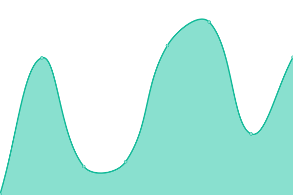
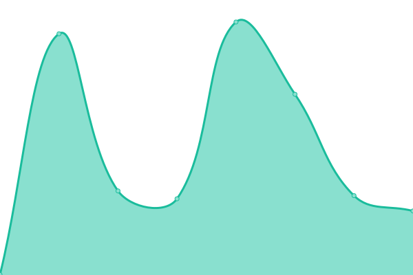
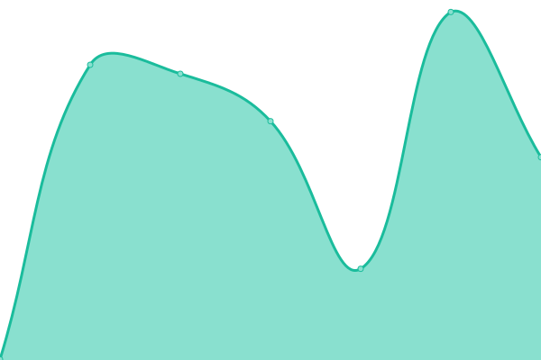
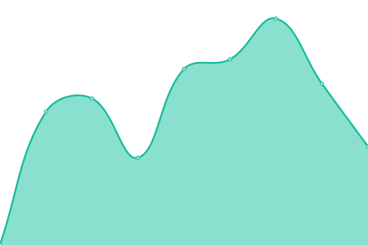
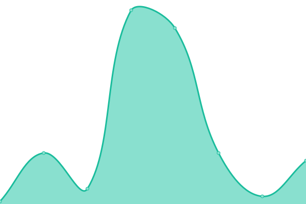
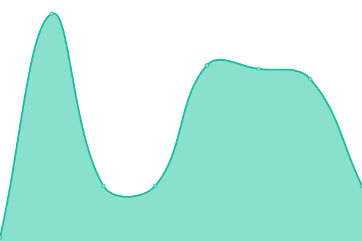
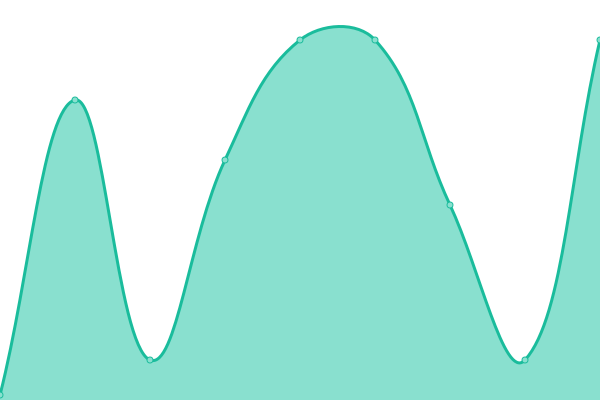
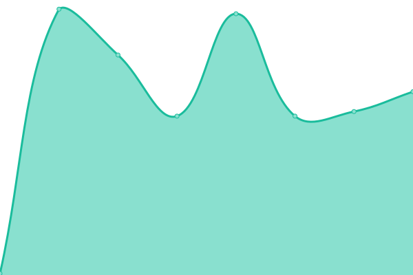

# [📈 Live Status](https://status.cm-ss13.com): <!--live status--> **🟩 All systems operational**

This repository contains the open-source uptime monitor and status page for [cmss13-devs](https://cm-ss13.com), powered by [Upptime](https://github.com/upptime/upptime).

With [Upptime](https://upptime.js.org), you can get your own unlimited and free uptime monitor and status page, powered entirely by a GitHub repository. We use [Issues](https://github.com/cmss13-devs/status/issues) as incident reports, [Actions](https://github.com/cmss13-devs/status/actions) as uptime monitors, and [Pages](https://status.cm-ss13.com) for the status page.

<!--start: status pages-->
<!-- This summary is generated by Upptime (https://github.com/upptime/upptime) -->
<!-- Do not edit this manually, your changes will be overwritten -->
<!-- prettier-ignore -->
| URL | Status | History | Response Time | Uptime |
| --- | ------ | ------- | ------------- | ------ |
|  [Internal - Analytics](https://grafana.cm-ss13.com) | 🟩 Up | [internal-analytics.yml](https://github.com/cmss13-devs/status/commits/HEAD/history/internal-analytics.yml) | 

 808ms
     
 | 

<a href="https://status.cm-ss13.com/history/internal-analytics">89.43%</a>
    

|  [Internal - Authentication](https://login.cm-ss13.com) | 🟩 Up | [internal-authentication.yml](https://github.com/cmss13-devs/status/commits/HEAD/history/internal-authentication.yml) | 

 212ms
     
 | 

<a href="https://status.cm-ss13.com/history/internal-authentication">89.45%</a>
    

|  [Internal - Game Management](https://tgs.cm-ss13.com) | 🟩 Up | [internal-game-management.yml](https://github.com/cmss13-devs/status/commits/HEAD/history/internal-game-management.yml) | 

 197ms
     
 | 

<a href="https://status.cm-ss13.com/history/internal-game-management">89.95%</a>
    

|  [Internal - Logs](https://logs.cm-ss13.com) | 🟩 Up | [internal-logs.yml](https://github.com/cmss13-devs/status/commits/HEAD/history/internal-logs.yml) | 

 420ms
     
 | 

<a href="https://status.cm-ss13.com/history/internal-logs">89.46%</a>
    

|  [Internal - Raw Logs](https://raw-logs.cm-ss13.com) | 🟩 Up | [internal-raw-logs.yml](https://github.com/cmss13-devs/status/commits/HEAD/history/internal-raw-logs.yml) | 

 400ms
     
 | 

<a href="https://status.cm-ss13.com/history/internal-raw-logs">89.94%</a>
    

|  [All - Forums](https://forum.cm-ss13.com) | 🟩 Up | [all-forums.yml](https://github.com/cmss13-devs/status/commits/HEAD/history/all-forums.yml) | 

 205ms
     
 | 

<a href="https://status.cm-ss13.com/history/all-forums">89.94%</a>
    

|  [All - Website](https://cm-ss13.com) | 🟩 Up | [all-website.yml](https://github.com/cmss13-devs/status/commits/HEAD/history/all-website.yml) | 

 1112ms
     
 | 

<a href="https://status.cm-ss13.com/history/all-website">94.81%</a>
    

|  [All - Wiki](https://cm-ss13.com/wiki) | 🟩 Up | [all-wiki.yml](https://github.com/cmss13-devs/status/commits/HEAD/history/all-wiki.yml) | 

 169ms
     
 | 

<a href="https://status.cm-ss13.com/history/all-wiki">89.74%</a>
    

|  [Relay - US East](us-e.cm-ss13.com) | 🟩 Up | [relay-us-east.yml](https://github.com/cmss13-devs/status/commits/HEAD/history/relay-us-east.yml) | 

 18ms
     
 | 

<a href="https://status.cm-ss13.com/history/relay-us-east">100.00%</a>
    

|  [Relay - US West](us-w.cm-ss13.com) | 🟩 Up | [relay-us-west.yml](https://github.com/cmss13-devs/status/commits/HEAD/history/relay-us-west.yml) | 

 56ms
     
 | 

<a href="https://status.cm-ss13.com/history/relay-us-west">100.00%</a>
    

|  [Relay - US NYC](nyc.cm-ss13.com) | 🟩 Up | [relay-us-nyc.yml](https://github.com/cmss13-devs/status/commits/HEAD/history/relay-us-nyc.yml) | 

 18ms
     
 | 

<a href="https://status.cm-ss13.com/history/relay-us-nyc">100.00%</a>
    

|  [Relay - EU East](eu-e.cm-ss13.com) | 🟩 Up | [relay-eu-east.yml](https://github.com/cmss13-devs/status/commits/HEAD/history/relay-eu-east.yml) | 

 120ms
     
 | 

<a href="https://status.cm-ss13.com/history/relay-eu-east">100.00%</a>
    

|  [Relay - EU West](eu-w.cm-ss13.com) | 🟩 Up | [relay-eu-west.yml](https://github.com/cmss13-devs/status/commits/HEAD/history/relay-eu-west.yml) | 

 101ms
     
 | 

<a href="https://status.cm-ss13.com/history/relay-eu-west">100.00%</a>
    

|  [Relay - UK](uk.cm-ss13.com) | 🟩 Up | [relay-uk.yml](https://github.com/cmss13-devs/status/commits/HEAD/history/relay-uk.yml) | 

 92ms
     
 | 

<a href="https://status.cm-ss13.com/history/relay-uk">100.00%</a>
    

|  [Relay - AUS](aus.cm-ss13.com) | 🟩 Up | [relay-aus.yml](https://github.com/cmss13-devs/status/commits/HEAD/history/relay-aus.yml) | 

 183ms
     
 | 

<a href="https://status.cm-ss13.com/history/relay-aus">100.00%</a>
    

|  [Relay - ASIA-SE](asia-se.cm-ss13.com) | 🟩 Up | [relay-asia-se.yml](https://github.com/cmss13-devs/status/commits/HEAD/history/relay-asia-se.yml) | 

 212ms
     
 | 

<a href="https://status.cm-ss13.com/history/relay-asia-se">100.00%</a>
    

<!--end: status pages-->

[**Visit our status website →**](https://status.cm-ss13.com)

## 📄 License

- Powered by: [Upptime](https://github.com/upptime/upptime)
- Code: [MIT](./LICENSE) © [Anand Chowdhary](https://anandchowdhary.com), supported by [Pabio](https://pabio.com)
- Data in the `./history` directory: [Open Database License](https://opendatacommons.org/licenses/odbl/1-0/)
